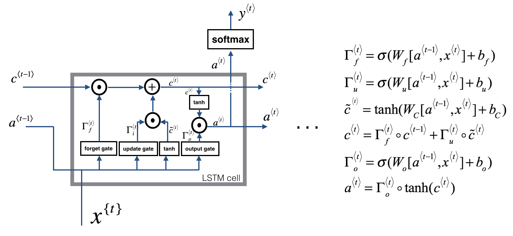
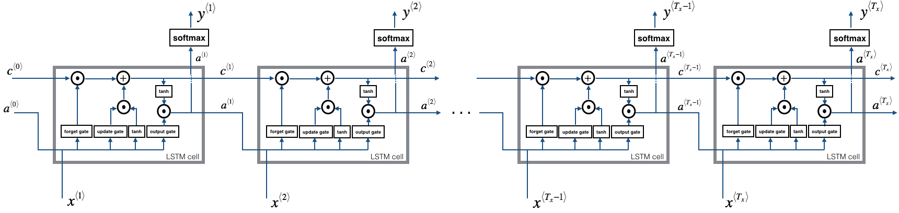
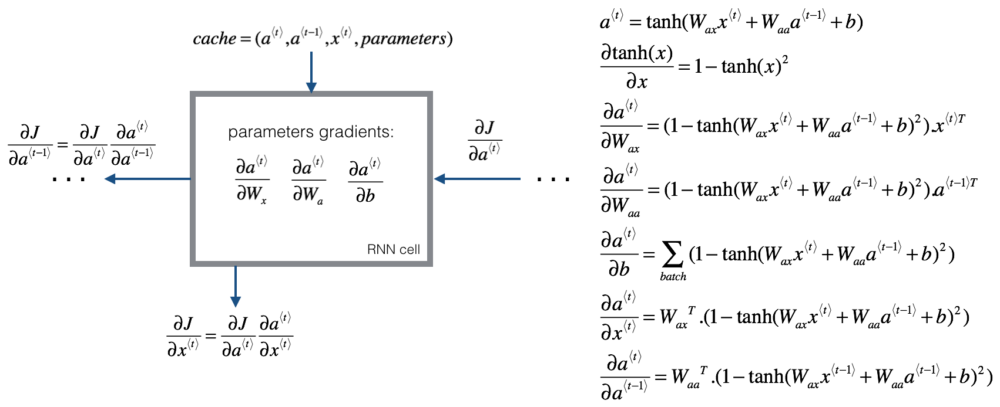

# 一步步搭建自己的循环神经网络

由于独特的记忆("memory")功能，循环神经网络(Recurrent Neural Network)在自然语言处理（NLP, Natual Language Processing）和其他处理序列的任务中有长足的应用。其可以在某个时间读取输入$x^{<t>}$（比如说是好多词），通过隐含层中从一个时间步到另一个时间步传递的激活值可以记录一些信息或者语义。比如单向的RNN（uni-directional RNN）可以获取来自过去的信息来产生后来的输出。而双向的RNN(bidirection RNN)可以从过去以及未来来获取语义信息。

[TOC]

**符号表示**：
- 方括号 $[l]$ 表明该对象和第$l$ 层相关
    - 例如：$a^{[4]}$表示第$4$层的激活（activation）。$W^{[5]}$和$b^{[5]}$是第$5$层的参数
- 圆括号 $(i)$ 表明该对象和第$i$个样本相关
    - 例如：$x^{(i)}$是第$i$个训练输入样本（example，周志华《🍉书》翻译成样例）
- 尖括号 $<t>$ 表明该对象在第$t$个事件步(time-step)
    - 例如：$x^{<t>}$是第$t$个时间步上的输入；$x^{(i)<t>}$是第$t$个时间步上的第$i$个样本
- 下标 $i$ 表明向量的第$i$个条目（entry）
    - 例如：$a_{i}^{[l]}$表明第$l$层的激活向量的第$i$个条目


首先来导入所需要的包


```python
import numpy as np
from rnn_utils import *
```

## 1 - 基本的RNN的前向传播(Forward propagation)

基本的RNN结构如下，示例中，$T_{x}=T_{y}$。
<!--  -->


<caption><center>**图1. 基本RNN结构模型** </center></caption>

开始着手实现一个RNN：

**步骤**：
1. 实现RNN在单个时间步上的计算
2. 实现在$T_{x}$时间步上的循环，来一次处理所有的输入。
就是这个思路，下面开干！

### 1.1 - RNN 单元
一个RNN可以看作是一个单一的RNN单元的重复。下图描述的是一个RNN单元在单个时间步上的计算。

<caption><center>**图2. 基本RNN单元** 获取输入$x^{<t>}$（当前输入）和$a^{<t-1>}$（从过去信息中得到的前一个隐藏状态(hidden state)），输出$a^{<t>}$，接着传递给下一个RNN单元，并以之来预测得到$y^{<t>}$。</center></caption>

**实战**：实现图2中描述的RNN基本单元

**步骤**：
1. 计算出tanh函数作为激活函数的隐藏值(hidden state):$a^{<t>}=tanh(W_{aa}a^{<t-1>}+W_{ax}x^{<t>}+b_{a})$
2. 使用新得到的隐藏值(hidden state)$a^{<t>}$，计算和预测$\hat{y}^{<t>}=softmax(W_{ya}a^{<t>}+b_y)$
3. 将计算值$(a^{<t>}, a^{<t-1>, x^{t}, parameters})$存储到元组cache中以便之后使用和返回
4. 返回$a^{<t>},y^{<t>},cache$

采用 $m$ 个样本，因此，$x^{<t>}$维度大小为$(n_{x}, m)$，$a^{<t>}$维度大小为$(n_{a}, m)$


```python
# 实现函数：rnn_cell_forward

def rnn_cell_forward(xt, a_prev, parameters):
    """
    对于单个RNN单元，实现如图2所示的单个前向步骤
    
    参数：
    xt -- 在 t 时间步上的输入数据，numpy数组，大小为(n_x, m)
    a_prep -- t-1 时间步的hidden state, numpy数组，大小为(n_a, m)
    parameters -- python 字典，包含：
                        Wax -- 和输入相乘的权重矩阵，numpy数组，大小为(n_a, n_x)
                        Waa -- 和隐藏状态相称的权重矩阵，numpy数组，大小为(n_a, n_a)
                        Wya -- 隐藏-输出之间相关的权重矩阵，numpy数组，大小为(n_y, n_a)
                        ba -- 偏差，numpy数组，大小是(n_a, 1)
                        by -- 偏差，隐藏-输出之间相关，numpy数组，大小为(n_y, 1)
    返回：
    a_next -- 下一个隐藏状态(hidden state)， 大小为(n_a, m)
    yt_pred -- 在时间步"t"上的预测值，numpy数组，大小为(n_y, m)
    cache -- 反向传播所需要的变量组成的元组，包含(a_next, a_prep, xt, parameters)
                        
    """
    
    # 从"parameters" 中回取参数
    Wax = parameters["Wax"]
    Waa = parameters["Waa"]
    Wya = parameters["Wya"]
    ba = parameters["ba"]
    by = parameters["by"]
    
    # 根据上方给定的公式来计算下一个激活状态
    a_next = np.tanh(np.dot(Waa, a_prev) + np.dot(Wax, xt) + ba)
    # 根据上方给定的公职来计算当前单元的输出
    yt_pred = softmax(np.dot(Wya, a_next)+ by)
    
    # 存储反向传播所需要的中间变量
    cache = (a_next, a_prev, xt, parameters)
    
    return a_next, yt_pred, cache
    
    
```


```python
np.random.seed(1)
xt = np.random.randn(3,10)
a_prev = np.random.randn(5,10)
Waa = np.random.randn(5,5)
Wax = np.random.randn(5,3)
Wya = np.random.randn(2,5)
ba = np.random.randn(5,1)
by = np.random.randn(2,1)
parameters = {"Waa": Waa, "Wax": Wax, "Wya": Wya, "ba": ba, "by": by}

a_next, yt_pred, cache = rnn_cell_forward(xt, a_prev, parameters)
print("a_next[4] = ", a_next[4])
print("a_next.shape = ", a_next.shape)
print("yt_pred[1] =", yt_pred[1])
print("yt_pred.shape = ", yt_pred.shape)
```

    a_next[4] =  [ 0.59584544  0.18141802  0.61311866  0.99808218  0.85016201  0.99980978
     -0.18887155  0.99815551  0.6531151   0.82872037]
    a_next.shape =  (5, 10)
    yt_pred[1] = [ 0.9888161   0.01682021  0.21140899  0.36817467  0.98988387  0.88945212
      0.36920224  0.9966312   0.9982559   0.17746526]
    yt_pred.shape =  (2, 10)

### 1.2 - RNN 前向过程
### 1.2 - RNN 前向过程

可以将RNN是做是刚才实现的单元的重复，加入你的输入序列包含10个时间步，那么久需要将刚才的RNN单元重复十次。每个单元接收来自前一个单元的隐藏状态($a^{\langle t-1\rangle}$)和当前时间步上的输入数据($x^{\langle t\rangle}$),其输出一个隐藏状态($a^{<t>}$)以及当前时间步上的预测($y^{\langle t\rangle}$)。


<caption>
<center>**图3. 基本RNN。**输入序列 $x=(x^{\langle 1\rangle}, x^{\langle 2 \rangle},...,x^{\langle T_x\rangle})$包含$T_x$个时间步。网络的输出是$y=(y^{\langle 1 \rangle}, y^{\langle 2\rangle},...,y^{\langle T_{x} \rangle})$
</center>
</caption>

**实战**：实现图3中的RNN的前向传播过程。

**步骤**：
1. 创建一个全零向量 ($a$) 用来存储RNN中计算过程中得到的全部隐藏状态
2. 初始化"next"隐藏状态为$a_0$（即初始的隐藏状态）
3. 开始在每个时间步上循环，递增的索引值是$t$：
    - 运行`rnn_cell_forward`函数对"下一个"隐藏状态和cache进行更行
    - 将"下一个"隐藏状态的值存入$a$（第$t$的位置）
    - 将预测值存储到变量y中
    - 将cache值加入到列表caches中
4. 返回$a$,$y$和caches


```python
# 实现函数：rnn_forward

def rnn_forward(x, a0, parameters):
    """
    实现RNN的前向传播过程
    
    参数：
    x -- 每个时间步上的输入数据，大小为(n_x, m, T_x)
    a0 -- 初始的隐藏状态，大小为(n_a, m)
    parameters -- python 字典包含：
                        Waa -- 和隐藏状态相乘的权重矩阵，numpy数组，大小为(n_a, n_a)
                        Wax -- 和输入状态相乘的权重矩阵，numpy数组，大小为(n_a, n_x)
                        Wya -- 隐藏-输出之间相关的权重矩阵，numpy数组，大小为(n_y, n_a)
                        ba -- 偏差，numpy 数组，大小为(n_a, 1)
                        by -- 隐藏-输出相关的偏差，numpy数组，大小为(n_y, 1)
    返回：
    a -- 每个时间步上的隐藏状态，numpy数组，大小为(n_a, m, T_x)
    y_pred -- 对于每个时间步骤得到的预测，numpy数组，大小为(n_y, m, T_x)
    cache -- 用于反向传播的值，包含(caches列表, x)
    """
    # 初始化caches 列表，其中包含所有的cache
    caches = []
    
    # 从x的大小和parameters["Wya"]回取维数
    n_x, m, T_x = x.shape
    n_y, n_a = parameters["Wya"].shape
    
    # 使用全零矩阵来初始化 "a" 和 "y"
    a = np.zeros((n_a, m, T_x))
    y_pred = np.zeros((n_y, m, T_x))
    
    # 初始化 a_next 
    a_next = a0
    
    # 在所有时间步上遍历
    for t in range(T_x):
        # 更新下一个隐藏状态，计算预测值，得到cache 
        a_next, yt_pred, cache = rnn_cell_forward(x[:, :, t], a_next, parameters)
        # 将新的"下一个" 隐藏状态保存到 a 中
        a[:, :, t] = a_next
        # 将计算的预测值保存到 y 中
        y_pred[:, :, t]= yt_pred
        # 将cache增加到caches中
        caches.append(cache)
    caches = (caches, x)
    return a, y_pred, caches
    
```


```python
np.random.seed(1)
x = np.random.randn(3, 10, 4)
a0 = np.random.randn(5, 10)
Waa = np.random.randn(5, 5)
Wax = np.random.randn(5, 3)
Wya = np.random.randn(2, 5)
ba = np.random.randn(5, 1)
by = np.random.randn(2, 1)
parameters = {"Waa": Waa, "Wax": Wax, "Wya": Wya, "ba": ba, "by":by}

a, y_pred, caches = rnn_forward(x, a0, parameters)
print("a[4][1] = ", a[4][1])
print("a.shape = ", a.shape)
print("y_pred[1][3] = ", y_pred[1][3])
print("y_pred.shape = ", y_pred.shape)
print("caches[1][1][3] = ", caches[1][1][3])
print("len(caches) =", len(caches))
```

    a[4][1] =  [-0.99999375  0.77911235 -0.99861469 -0.99833267]
    a.shape =  (5, 10, 4)
    y_pred[1][3] =  [ 0.79560373  0.86224861  0.11118257  0.81515947]
    y_pred.shape =  (2, 10, 4)
    caches[1][1][3] =  [-1.1425182  -0.34934272 -0.20889423  0.58662319]
    len(caches) = 2

目前为止,从头实现了循环神经网络的前向传播(forward propagation),这对于有的应用来说已经很足够了.但是这样还存在梯度消失的问题.所以其适用于,输出$y^{\langle t \rangle}$建立在"本地"上下文(context)(也就是说建立在输入$x^{\langle t' \rangle}$之上,其中$t'$和$t$相隔不远)。
目前为止,从头实现了循环神经网络的前向传播(forward propagation),这对于有的应用来说已经很足够了.但是这样还存在梯度消失的问题.所以其适用于,输出$y^{\langle t \rangle}$建立在"本地"上下文(context)(也就是说建立在输入$x^{\langle t' \rangle}$之上,其中$t'$和$t$相隔不远)。

相比之下,LSTM模型有更好的表现，能够经过多个时间步依然能保存从序列中获取的信息，并能够消除梯度消失的问题。

## 2- Long Short-Term Memony(LSTM) 网络

下图为LSTM单元及其内部计算示意图：

<caption><center>**图4. LSTM单元**：在每个时间步单元状态("cell state")或者叫记忆("memory")变量$c^{\langle t \rangle}$会进行传递和更新，和$a^{\langle t \rangle}$进行区分。</center></caption>

和上述的RNN类似，还是需要先实现在单个时间步上的LSTM单元。随后，使用一个`for`循环，实现整个$T_x$时间上的迭代调用。

### 关于门机制
#### - Forget(遗忘)门

为了更好地解释，假设我们需要从一段文本中读取其中的词汇，我们希望使用LSTM来保持对文本的语法结构跟踪，比方说代词是单数还是复数。当代词从单数转到复数，我们需要找到一种方法来避免从之前从单数/复数中获取的存储值的影响。LSTM中，遗忘门就是进行这个操作：

$$\Gamma_f^{\langle t \rangle}=\sigma(W_f[a^{\langle t-1 \rangle},x^{\langle t \rangle}]+b_f) \tag{1}$$

其中$W_f$用以管理遗忘门的状态。$[a^{\langle t-1 \rangle}, x^{\langle t \rangle}]$和$W_f$相乘。得到的结果向量$\Gamma_f^{\langle t \rangle}$元素的返回在0和1之间。遗忘门向量和之前的单元状态$c^{\langle t-1 \rangle}$进行元素积。所以，如果 $\Gamma_f^{\langle t \rangle}$中的值是0或者是接近于零，这就意味着LSTM应该在$c^{\langle t-1 \rangle}$中对应的地方移除该信息（比如，是单数的代词）。假如这个值是1的话，也就是会保留这个信息。

#### - Update(更新)门

一旦我们选择忘记当前的代词是单数，这时候就需要找到一种方法来反映新出现的代词是复数。下方是更新门进行更新的公式：

$$\Gamma_u^{\langle t \rangle} = \sigma(W_u[a^{\langle t-1 \rangle}, x^{\{t\}}])\tag{2}$$

和遗忘门类似，这里的$\Gamma_u^{\langle t \rangle} $同样是值域在0到1之间的向量。将和$\tilde{c}^{\langle t \rangle}$进行元素积，从而计算出$c^{\langle t \rangle}$。

#### - 更新LSMT单元
为了对于新的代词进行更新，我们需要创建一个新的数字向量，将其加到我们之前获得的单元状态中，公式如下：
$$\tilde{c}^{\langle t \rangle}= \tanh(W_c[a^{\langle t-1 \rangle}, x^{\langle t \rangle}]+b_c) \tag{3}$$

最后，新的单元状态为:

$$c^{\langle t \rangle}=\Gamma_f^{\langle t \rangle}*c^{\langle t-1 \rangle}+\Gamma_u^{\langle t \rangle}*\tilde{c}^{\langle t \rangle} \tag{4}$$

#### - Output(输出)门

为了决定我们最终采用那个暑促，我们使用下面两个公式:
$$\Gamma_o^{\langle t \rangle}=\sigma(W_o[a^{}\langle t-1 \rangle, x^{\langle t \rangle}]+b_o) \tag{5}
$$
$$a^{\langle t \rangle}=\Gamma_o^{\langle t \rangle}* \tanh(c^{langle t \rangle}) \tag{6}$$


### 2.1 - LSTM单元(cell)

**实战**:实现图3中的LSTM单元

**步骤**:
1. 将$a^{\langle t-1 \rangle}$和$x^{\angle t \rangle}$叠加成为一个单一矩阵:$concat=\begin{bmatrix} a^{\langle t-1 \rangle} \\ x^{\langle t \rangle}
\end{bmatrix}$
2. 计算公式1到公式6.(用到`sigmoid()`和`np.tanh()`函数)
3. 计算预测值$y^{\langle t \rangle}$(使用到`softmax()`函数)


```python
# 实现函数：lstm_cell_forward

def lstm_cell_forward(xt, a_prev, c_prev, parameters):
    """
    实现图4中，单个前向步骤上的LSTM单元。
    
    参数：
    xt -- 在第"t"个时间步上的输入数据，numpy数组，大小为(n_x, m)
    a_prev -- 在第"t-1"个时间步上的隐藏状态，numpy数组，大小为(n_a, m)
    c_prev -- 在第"t-1"个时间步上的记忆状态，numpy数组，大小为(n_a, m)
    parameters -- python字典，其中包含：
                        Wf -- 遗忘门的权重矩阵，numpy数组，大小为(n_a, n_a+n_x)
                        bf -- 遗忘门的偏差，numpy数组，大小为(n_a, 1)
                        Wi -- 更新门的权重矩阵, numpy数组，大小为(n_a, n_a+n_x)
                        bi -- 更新门的偏差，numpy数组，大小为(n_a, 1)
                        Wc -- 第一个"tanh"的权重矩阵，numpy数组，大小为(n_a, n_a+n_x)
                        bc -- 第一个"tanh"的偏差，numpy数组，大小为(n_a, 1)
                        Wo -- 输出门的权重矩阵，numpy数组，大小为(n_a, n_a+n_x)
                        bo -- 输出门的偏差，numpy数组，大小为(n_a, 1)
                        Wy -- 隐藏状态和输出之间的权重矩阵，numpy数组，大小为(n_y, n_a)
                        by -- 隐藏状态和输出之间的权重矩阵，numpy数组，大小为(n_y, 1)
                    
    返回值：
    a_next -- 下一个隐藏状态，大小为(n_a, m)
    c_next -- 下一个记忆状态，大小为(n_a, m)
    yt_pred -- 在时间步"t"上的预测值，numpy数组，大小为(n_y, m)
    cache -- 反向过程中所需要的值组成的元组，包含(a_next, c_next, a_prev, xt, parameters)
    
    注意: ft/it/ot 代表 forget/update/ouput门，cct 代表中间候选(candidate )值
        c代表记忆(memory)值
    """
    # 从parameters中取回各个变量
    Wf = parameters["Wf"]
    bf = parameters["bf"]
    Wi = parameters["Wi"]
    bi = parameters["bi"]
    Wc = parameters["Wc"]
    bc = parameters["bc"]
    Wo = parameters["Wo"]
    bo = parameters["bo"]
    Wy = parameters["Wy"]
    by = parameters["by"]
    
    # 从xt 和 Wy 中取回各个维度数
    n_x, m = xt.shape
    n_y, n_a = Wy.shape
    
    # 连接 a_prep 和 xt
    concat = np.zeros((n_a+n_x,m))
    concat[: n_a, :] = a_prev
    concat[n_a :, :] = xt
    
    # 使用上方给定的公式来计算 ft, it, cct, ot, a_next
    ft = sigmoid(np.dot(Wf, concat)+bf)
    it = sigmoid(np.dot(Wi, concat)+bi) 
    cct = np.tanh(np.dot(Wc, concat)+bc)
    c_next = ft*c_prev+it*cct
    ot = sigmoid(np.dot(Wo, concat)+bo)
    a_next = ot*np.tanh(c_next)
    
    # 计算LSTM单元的预测值
    yt_pred = softmax(np.dot(Wy, a_next)+ by)
    
    cache = (a_next, c_next, a_prev ,c_prev, ft, it, cct, ot, xt, parameters)
    
    return a_next,c_next, yt_pred, cache
    
```


```python
np.random.seed(1)
xt = np.random.randn(3,10)
a_prev = np.random.randn(5,10)
c_prev = np.random.randn(5,10)
Wf = np.random.randn(5, 5+3)
bf = np.random.randn(5,1)
Wi = np.random.randn(5, 5+3)
bi = np.random.randn(5,1)
Wo = np.random.randn(5, 5+3)
bo = np.random.randn(5,1)
Wc = np.random.randn(5, 5+3)
bc = np.random.randn(5,1)
Wy = np.random.randn(2,5)
by = np.random.randn(2,1)

parameters = {"Wf": Wf, "Wi": Wi, "Wo": Wo, "Wc": Wc, "Wy": Wy, "bf": bf, "bi": bi, "bo": bo, "bc": bc, "by": by}

a_next, c_next, yt, cache = lstm_cell_forward(xt, a_prev, c_prev, parameters)
print("a_next[4] = ", a_next[4])
print("a_next.shape = ", c_next.shape)
print("c_next[2] = ", c_next[2])
print("c_next.shape = ", c_next.shape)
print("yt[1] =", yt[1])
print("yt.shape = ", yt.shape)
print("cache[1][3] =", cache[1][3])
print("len(cache) = ", len(cache))
```

    a_next[4] =  [-0.66408471  0.0036921   0.02088357  0.22834167 -0.85575339  0.00138482
      0.76566531  0.34631421 -0.00215674  0.43827275]
    a_next.shape =  (5, 10)
    c_next[2] =  [ 0.63267805  1.00570849  0.35504474  0.20690913 -1.64566718  0.11832942
      0.76449811 -0.0981561  -0.74348425 -0.26810932]
    c_next.shape =  (5, 10)
    yt[1] = [ 0.79913913  0.15986619  0.22412122  0.15606108  0.97057211  0.31146381
      0.00943007  0.12666353  0.39380172  0.07828381]
    yt.shape =  (2, 10)
    cache[1][3] = [-0.16263996  1.03729328  0.72938082 -0.54101719  0.02752074 -0.30821874
      0.07651101 -1.03752894  1.41219977 -0.37647422]
    len(cache) =  10

### 2.2- LSTM的前向过程
### 2.2- LSTM的前向过程

前面实现了对于LSTM的单个时间步上的前向传播，现在使用`for`循环实现整个`Tx`输入上的序列处理：

<caption><center>**图5. 多时间步上的LSTM**</center></caption>

**实战**：实现`lstm_forward()`来在$T_x$上运行LSTM

**注意**：$c^{\langle 0 \rangle}初始化为全零矩阵$


```python
# 实现函数：lstm_forward 

def lstm_forward(x, a0, parameters):
    """
    实现使用LSTM作为处理单元的循环神经网络上的前向传播
    
    参数：
    x -- 每个时间步上的输入输入数据，大小为(n_x, m, T_x)
    a0 -- 初始化的隐藏状态，大小为(n_a, m)
    parameters -- python字典，包含：
                        Wf -- 遗忘门的权重矩阵，nmypy数组，大小是(n_a, n_a+n_x)
                        bf -- 遗忘门的偏差，numpy数组，大小是(n_a, 1)
                        Wi -- 更新门的权重矩阵, numpy数组，大小为(n_a, n_a+n_x)
                        bi -- 更新门的偏差，numpy数组，大小为(n_a, 1)
                        Wc -- 第一个"tanh"的权重矩阵，numpy数组，大小为(n_a, n_a+n_x)
                        bc -- 第一个"tanh"的偏差，numpy数组，大小为(n_a, 1)
                        Wo -- 输出门的权重矩阵，numpy数组，大小为(n_a, n_a+n_x)
                        bo -- 输出门的偏差，numpy数组，大小为(n_a, 1)
                        Wy -- 隐藏状态和输出之间的权重矩阵，numpy数组，大小为(n_y, n_a)
                        by -- 隐藏状态和输出之间的权重矩阵，numpy数组，大小为(n_y, 1)
    返回：
    a -- 在所有时间步上的隐藏状态，numpy数组，大小为(n_a, m, T_x)
    y -- 对于每个时间步上的预测，numpy数组，大小为(n_y, m, T_x)
    c -- 在所有时间步上的记忆状态，numpy数组，大小为(n_a, m, T_x) # 注释，作业没有这句，自行补上的
    caches -- 所有用于方向过程的值组成的元组，包含(cache列表, x)
    
    """
    # 初始化"caches"
    caches = []
    
    # 从 x 和 parameters['Wy']中取回维度数
    n_x, m, T_x = x.shape
    n_y, n_a = parameters["Wy"].shape
    
    # 初始化"a", "x", "y"为全零
    a = np.zeros((n_a, m, T_x))
    c = np.zeros((n_a, m, T_x))
    y = np.zeros((n_y, m, T_x))
    
    # 初始化 a_next 和 c_next
    a_next = a0
    c_next = np.zeros((n_a, m))
    
    # 所有时间步上的循环
    for t in range(T_x):
        # 更新隐藏状态，下一个记忆状态，计算预测，保存cache
        a_next, c_next, yt, cache = lstm_cell_forward(x[:, :, t], a_next, c_next, parameters)
        # 将新的"next"隐藏状态保存到a中
        a[:, :, t] = a_next
        # 将预测值保存到y中
        y[:,:,t] = yt
        # 存储下一个单元状态
        c[:,:,t] = c_next
        # 存储cache到caches
        caches.append(cache)
    
    # 将反向传播的值存储
    caches = (caches, x)

    return a, y, c, caches
```


```python
np.random.seed(1)
x = np.random.randn(3,10,7)
a0 = np.random.randn(5,10)
Wf = np.random.randn(5, 5+3)
bf = np.random.randn(5,1)
Wi = np.random.randn(5, 5+3)
bi = np.random.randn(5,1)
Wo = np.random.randn(5, 5+3)
bo = np.random.randn(5,1)
Wc = np.random.randn(5, 5+3)
bc = np.random.randn(5,1)
Wy = np.random.randn(2,5)
by = np.random.randn(2,1)

parameters = {"Wf": Wf, "Wi": Wi, "Wo": Wo, "Wc": Wc, "Wy": Wy, "bf": bf, "bi": bi, "bo": bo, "bc": bc, "by": by}

a, y, c, caches = lstm_forward(x, a0, parameters)
print("a[4][3][6] = ", a[4][3][6])
print("a.shape = ", a.shape)
print("y[1][4][3] =", y[1][4][3])
print("y.shape = ", y.shape)
print("caches[1][1[1]] =", caches[1][1][1])
print("c[1][2][1]", c[1][2][1])
print("len(caches) = ", len(caches))
```

    a[4][3][6] =  0.172117767533
    a.shape =  (5, 10, 7)
    y[1][4][3] = 0.95087346185
    y.shape =  (2, 10, 7)
    caches[1][1[1]] = [ 0.82797464  0.23009474  0.76201118 -0.22232814 -0.20075807  0.18656139
      0.41005165]
    c[1][2][1] -0.855544916718
    len(caches) =  2

到目前为止，已经实现了基本RNN和LSTM的整个前向过程。当使用深度学习的结构，实现前向过程，对于构建能产生比较好结果的系统已经最够用了。当然，不满足于此，后面接着实现循环神经网络的反向传播。
到目前为止，已经实现了基本RNN和LSTM的整个前向过程。当使用深度学习的结构，实现前向过程，对于构建能产生比较好结果的系统已经最够用了。当然，不满足于此，后面接着实现循环神经网络的反向传播。

## 3 - 循环神经网络中的反向传播过程

在现有的深层神经学习网络中，一般只需要实现前向传播就足矣，因为深度学习的结构能够负责反向传播，对于大多数的深度学习工程师来说不需要过于计较反向传播的太多具体细节。

之前实现过一个简单的（全连接）的神经网络，我们使用反向传播来计算cast对于那些参数的倒数。类似的，在循环神经网络总，我们也可以计算由于参数更新关于cost的倒数。反向传播的计算公式比较复杂，下面只做简单的介绍。

### 3.1 - 基本RNN的反向过程

和上面的一样，依然从计算基本RNN单元的反向过程来计算起。

<br>
<caption><center>**图6. RNN单元的反向过程**: 和全连接神经网络类似，在整个RNN上，成本(cost)函数$J$导数的计算遵循链式法则，链式法则同样用于计算$(\frac{\partial J}{\partial W_{ax}},\frac{\partial J}{\partial W_{aa}},\frac{\partial J}{\partial b})$,从而对$(W_{ax}, W_{aa}, b_a)$进行更新。

#### 求导

为了计算`rnn_cell_backward`，需要计算出下列公式，自己动手推导将是很好的练习。

函数$\tanh $的倒数是$1-\tanh(x)^2$,你可以在[这里](https://www.wyzant.com/resources/lessons/math/calculus/derivative_proofs/tanx)找到公式的完整证明。注意：$\text{sech}(x)^2=1-\tanh(x)^2$

所以同理，$\frac{ \partial a^{\langle t \rangle} } {\partial W_{ax}}, \frac{ \partial a^{\langle t \rangle} } {\partial W_{aa}},  \frac{ \partial a^{\langle t \rangle} } {\partial b}$ ,$\tanh(u)$ 的导数是$(1-\tanh(u)^2)du$。


```python
def rnn_cell_backward(da_next, cache):
    """
    Implements the backward pass for the RNN-cell (single time-step).

    Arguments:
    da_next -- Gradient of loss with respect to next hidden state
    cache -- python dictionary containing useful values (output of rnn_cell_forward())

    Returns:
    gradients -- python dictionary containing:
                        dx -- Gradients of input data, of shape (n_x, m)
                        da_prev -- Gradients of previous hidden state, of shape (n_a, m)
                        dWax -- Gradients of input-to-hidden weights, of shape (n_a, n_x)
                        dWaa -- Gradients of hidden-to-hidden weights, of shape (n_a, n_a)
                        dba -- Gradients of bias vector, of shape (n_a, 1)
    """
    
    # Retrieve values from cache
    (a_next, a_prev, xt, parameters) = cache
    
    # Retrieve values from parameters
    Wax = parameters["Wax"]
    Waa = parameters["Waa"]
    Wya = parameters["Wya"]
    ba = parameters["ba"]
    by = parameters["by"]

    ### START CODE HERE ###
    # compute the gradient of tanh with respect to a_next (≈1 line)
    dtanh = None

    # compute the gradient of the loss with respect to Wax (≈2 lines)
    dxt = None
    dWax = None

    # compute the gradient with respect to Waa (≈2 lines)
    da_prev = None
    dWaa = None

    # compute the gradient with respect to b (≈1 line)
    dba = None

    ### END CODE HERE ###
    
    # Store the gradients in a python dictionary
    gradients = {"dxt": dxt, "da_prev": da_prev, "dWax": dWax, "dWaa": dWaa, "dba": dba}
    
    return gradients
```


```python
np.random.seed(1)
xt = np.random.randn(3,10)
a_prev = np.random.randn(5,10)
Wax = np.random.randn(5,3)
Waa = np.random.randn(5,5)
Wya = np.random.randn(2,5)
b = np.random.randn(5,1)
by = np.random.randn(2,1)
parameters = {"Wax": Wax, "Waa": Waa, "Wya": Wya, "ba": ba, "by": by}

a_next, yt, cache = rnn_cell_forward(xt, a_prev, parameters)

da_next = np.random.randn(5,10)
gradients = rnn_cell_backward(da_next, cache)
print("gradients[\"dxt\"][1][2] =", gradients["dxt"][1][2])
print("gradients[\"dxt\"].shape =", gradients["dxt"].shape)
print("gradients[\"da_prev\"][2][3] =", gradients["da_prev"][2][3])
print("gradients[\"da_prev\"].shape =", gradients["da_prev"].shape)
print("gradients[\"dWax\"][3][1] =", gradients["dWax"][3][1])
print("gradients[\"dWax\"].shape =", gradients["dWax"].shape)
print("gradients[\"dWaa\"][1][2] =", gradients["dWaa"][1][2])
print("gradients[\"dWaa\"].shape =", gradients["dWaa"].shape)
print("gradients[\"dba\"][4] =", gradients["dba"][4])
print("gradients[\"dba\"].shape =", gradients["dba"].shape)
```

#### Backward pass through the RNN

Computing the gradients of the cost with respect to $a^{\langle t \rangle}$ at every time-step $t$ is useful because it is what helps the gradient backpropagate to the previous RNN-cell. To do so, you need to iterate through all the time steps starting at the end, and at each step, you increment the overall $db_a$, $dW_{aa}$, $dW_{ax}$ and you store $dx$.

**Instructions**:

Implement the `rnn_backward` function. Initialize the return variables with zeros first and then loop through all the time steps while calling the `rnn_cell_backward` at each time timestep, update the other variables accordingly.


```python
def rnn_backward(da, caches):
    """
    Implement the backward pass for a RNN over an entire sequence of input data.

    Arguments:
    da -- Upstream gradients of all hidden states, of shape (n_a, m, T_x)
    caches -- tuple containing information from the forward pass (rnn_forward)
    
    Returns:
    gradients -- python dictionary containing:
                        dx -- Gradient w.r.t. the input data, numpy-array of shape (n_x, m, T_x)
                        da0 -- Gradient w.r.t the initial hidden state, numpy-array of shape (n_a, m)
                        dWax -- Gradient w.r.t the input's weight matrix, numpy-array of shape (n_a, n_x)
                        dWaa -- Gradient w.r.t the hidden state's weight matrix, numpy-arrayof shape (n_a, n_a)
                        dba -- Gradient w.r.t the bias, of shape (n_a, 1)
    """
        
    ### START CODE HERE ###
    
    # Retrieve values from the first cache (t=1) of caches (≈2 lines)
    (caches, x) = None
    (a1, a0, x1, parameters) = None
    
    # Retrieve dimensions from da's and x1's shapes (≈2 lines)
    n_a, m, T_x = None
    n_x, m = None
    
    # initialize the gradients with the right sizes (≈6 lines)
    dx = None
    dWax = None
    dWaa = None
    dba = None
    da0 = None
    da_prevt = None
    
    # Loop through all the time steps
    for t in reversed(range(None)):
        # Compute gradients at time step t. Choose wisely the "da_next" and the "cache" to use in the backward propagation step. (≈1 line)
        gradients = None
        # Retrieve derivatives from gradients (≈ 1 line)
        dxt, da_prevt, dWaxt, dWaat, dbat = gradients["dxt"], gradients["da_prev"], gradients["dWax"], gradients["dWaa"], gradients["dba"]
        # Increment global derivatives w.r.t parameters by adding their derivative at time-step t (≈4 lines)
        dx[:, :, t] = None
        dWax += None
        dWaa += None
        dba += None
        
    # Set da0 to the gradient of a which has been backpropagated through all time-steps (≈1 line) 
    da0 = None
    ### END CODE HERE ###

    # Store the gradients in a python dictionary
    gradients = {"dx": dx, "da0": da0, "dWax": dWax, "dWaa": dWaa,"dba": dba}
    
    return gradients
```


```python
np.random.seed(1)
x = np.random.randn(3,10,4)
a0 = np.random.randn(5,10)
Wax = np.random.randn(5,3)
Waa = np.random.randn(5,5)
Wya = np.random.randn(2,5)
ba = np.random.randn(5,1)
by = np.random.randn(2,1)
parameters = {"Wax": Wax, "Waa": Waa, "Wya": Wya, "ba": ba, "by": by}
a, y, caches = rnn_forward(x, a0, parameters)
da = np.random.randn(5, 10, 4)
gradients = rnn_backward(da, caches)

print("gradients[\"dx\"][1][2] =", gradients["dx"][1][2])
print("gradients[\"dx\"].shape =", gradients["dx"].shape)
print("gradients[\"da0\"][2][3] =", gradients["da0"][2][3])
print("gradients[\"da0\"].shape =", gradients["da0"].shape)
print("gradients[\"dWax\"][3][1] =", gradients["dWax"][3][1])
print("gradients[\"dWax\"].shape =", gradients["dWax"].shape)
print("gradients[\"dWaa\"][1][2] =", gradients["dWaa"][1][2])
print("gradients[\"dWaa\"].shape =", gradients["dWaa"].shape)
print("gradients[\"dba\"][4] =", gradients["dba"][4])
print("gradients[\"dba\"].shape =", gradients["dba"].shape)
```

## 3.2 - LSTM backward pass

### 3.2.1 One Step backward

The LSTM backward pass is slighltly more complicated than the forward one. We have provided you with all the equations for the LSTM backward pass below. (If you enjoy calculus exercises feel free to try deriving these from scratch yourself.) 

### 3.2.2 gate derivatives

$$d \Gamma_o^{\langle t \rangle} = da_{next}*\tanh(c_{next}) * \Gamma_o^{\langle t \rangle}*(1-\Gamma_o^{\langle t \rangle})\tag{7}$$

$$d\tilde c^{\langle t \rangle} = dc_{next}*\Gamma_u^{\langle t \rangle}+ \Gamma_o^{\langle t \rangle} (1-\tanh(c_{next})^2) * i_t * da_{next} * \tilde c^{\langle t \rangle} * (1-\tanh(\tilde c)^2) \tag{8}$$

$$d\Gamma_u^{\langle t \rangle} = dc_{next}*\tilde c^{\langle t \rangle} + \Gamma_o^{\langle t \rangle} (1-\tanh(c_{next})^2) * \tilde c^{\langle t \rangle} * da_{next}*\Gamma_u^{\langle t \rangle}*(1-\Gamma_u^{\langle t \rangle})\tag{9}$$

$$d\Gamma_f^{\langle t \rangle} = dc_{next}*\tilde c_{prev} + \Gamma_o^{\langle t \rangle} (1-\tanh(c_{next})^2) * c_{prev} * da_{next}*\Gamma_f^{\langle t \rangle}*(1-\Gamma_f^{\langle t \rangle})\tag{10}$$

### 3.2.3 parameter derivatives 

$$ dW_f = d\Gamma_f^{\langle t \rangle} * \begin{pmatrix} a_{prev} \\ x_t\end{pmatrix}^T \tag{11} $$
$$ dW_u = d\Gamma_u^{\langle t \rangle} * \begin{pmatrix} a_{prev} \\ x_t\end{pmatrix}^T \tag{12} $$
$$ dW_c = d\tilde c^{\langle t \rangle} * \begin{pmatrix} a_{prev} \\ x_t\end{pmatrix}^T \tag{13} $$
$$ dW_o = d\Gamma_o^{\langle t \rangle} * \begin{pmatrix} a_{prev} \\ x_t\end{pmatrix}^T \tag{14}$$

To calculate $db_f, db_u, db_c, db_o$ you just need to sum across the horizontal (axis= 1) axis on $d\Gamma_f^{\langle t \rangle}, d\Gamma_u^{\langle t \rangle}, d\tilde c^{\langle t \rangle}, d\Gamma_o^{\langle t \rangle}$ respectively. Note that you should have the `keep_dims = True` option.

Finally, you will compute the derivative with respect to the previous hidden state, previous memory state, and input.

$$ da_{prev} = W_f^T*d\Gamma_f^{\langle t \rangle} + W_u^T * d\Gamma_u^{\langle t \rangle}+ W_c^T * d\tilde c^{\langle t \rangle} + W_o^T * d\Gamma_o^{\langle t \rangle} \tag{15}$$
Here, the weights for equations 13 are the first n_a, (i.e. $W_f = W_f[:n_a,:]$ etc...)

$$ dc_{prev} = dc_{next}\Gamma_f^{\langle t \rangle} + \Gamma_o^{\langle t \rangle} * (1- \tanh(c_{next})^2)*\Gamma_f^{\langle t \rangle}*da_{next} \tag{16}$$
$$ dx^{\langle t \rangle} = W_f^T*d\Gamma_f^{\langle t \rangle} + W_u^T * d\Gamma_u^{\langle t \rangle}+ W_c^T * d\tilde c_t + W_o^T * d\Gamma_o^{\langle t \rangle}\tag{17} $$
where the weights for equation 15 are from n_a to the end, (i.e. $W_f = W_f[n_a:,:]$ etc...)

**Exercise:** Implement `lstm_cell_backward` by implementing equations $7-17$ below. Good luck! :)


```python
def lstm_cell_backward(da_next, dc_next, cache):
    """
    Implement the backward pass for the LSTM-cell (single time-step).

    Arguments:
    da_next -- Gradients of next hidden state, of shape (n_a, m)
    dc_next -- Gradients of next cell state, of shape (n_a, m)
    cache -- cache storing information from the forward pass

    Returns:
    gradients -- python dictionary containing:
                        dxt -- Gradient of input data at time-step t, of shape (n_x, m)
                        da_prev -- Gradient w.r.t. the previous hidden state, numpy array of shape (n_a, m)
                        dc_prev -- Gradient w.r.t. the previous memory state, of shape (n_a, m, T_x)
                        dWf -- Gradient w.r.t. the weight matrix of the forget gate, numpy array of shape (n_a, n_a + n_x)
                        dWi -- Gradient w.r.t. the weight matrix of the update gate, numpy array of shape (n_a, n_a + n_x)
                        dWc -- Gradient w.r.t. the weight matrix of the memory gate, numpy array of shape (n_a, n_a + n_x)
                        dWo -- Gradient w.r.t. the weight matrix of the output gate, numpy array of shape (n_a, n_a + n_x)
                        dbf -- Gradient w.r.t. biases of the forget gate, of shape (n_a, 1)
                        dbi -- Gradient w.r.t. biases of the update gate, of shape (n_a, 1)
                        dbc -- Gradient w.r.t. biases of the memory gate, of shape (n_a, 1)
                        dbo -- Gradient w.r.t. biases of the output gate, of shape (n_a, 1)
    """

    # Retrieve information from "cache"
    (a_next, c_next, a_prev, c_prev, ft, it, cct, ot, xt, parameters) = cache
    
    ### START CODE HERE ###
    # Retrieve dimensions from xt's and a_next's shape (≈2 lines)
    n_x, m = None
    n_a, m = None
    
    # Compute gates related derivatives, you can find their values can be found by looking carefully at equations (7) to (10) (≈4 lines)
    dot = None
    dcct = None
    dit = None
    dft = None
    
    # Code equations (7) to (10) (≈4 lines)
    dit = None
    dft = None
    dot = None
    dcct = None

    # Compute parameters related derivatives. Use equations (11)-(14) (≈8 lines)
    dWf = None
    dWi = None
    dWc = None
    dWo = None
    dbf = None
    dbi = None
    dbc = None
    dbo = None

    # Compute derivatives w.r.t previous hidden state, previous memory state and input. Use equations (15)-(17). (≈3 lines)
    da_prev = None
    dc_prev = None
    dxt = None
    ### END CODE HERE ###
    
    # Save gradients in dictionary
    gradients = {"dxt": dxt, "da_prev": da_prev, "dc_prev": dc_prev, "dWf": dWf,"dbf": dbf, "dWi": dWi,"dbi": dbi,
                "dWc": dWc,"dbc": dbc, "dWo": dWo,"dbo": dbo}

    return gradients
```


```python
np.random.seed(1)
xt = np.random.randn(3,10)
a_prev = np.random.randn(5,10)
c_prev = np.random.randn(5,10)
Wf = np.random.randn(5, 5+3)
bf = np.random.randn(5,1)
Wi = np.random.randn(5, 5+3)
bi = np.random.randn(5,1)
Wo = np.random.randn(5, 5+3)
bo = np.random.randn(5,1)
Wc = np.random.randn(5, 5+3)
bc = np.random.randn(5,1)
Wy = np.random.randn(2,5)
by = np.random.randn(2,1)

parameters = {"Wf": Wf, "Wi": Wi, "Wo": Wo, "Wc": Wc, "Wy": Wy, "bf": bf, "bi": bi, "bo": bo, "bc": bc, "by": by}

a_next, c_next, yt, cache = lstm_cell_forward(xt, a_prev, c_prev, parameters)

da_next = np.random.randn(5,10)
dc_next = np.random.randn(5,10)
gradients = lstm_cell_backward(da_next, dc_next, cache)
print("gradients[\"dxt\"][1][2] =", gradients["dxt"][1][2])
print("gradients[\"dxt\"].shape =", gradients["dxt"].shape)
print("gradients[\"da_prev\"][2][3] =", gradients["da_prev"][2][3])
print("gradients[\"da_prev\"].shape =", gradients["da_prev"].shape)
print("gradients[\"dc_prev\"][2][3] =", gradients["dc_prev"][2][3])
print("gradients[\"dc_prev\"].shape =", gradients["dc_prev"].shape)
print("gradients[\"dWf\"][3][1] =", gradients["dWf"][3][1])
print("gradients[\"dWf\"].shape =", gradients["dWf"].shape)
print("gradients[\"dWi\"][1][2] =", gradients["dWi"][1][2])
print("gradients[\"dWi\"].shape =", gradients["dWi"].shape)
print("gradients[\"dWc\"][3][1] =", gradients["dWc"][3][1])
print("gradients[\"dWc\"].shape =", gradients["dWc"].shape)
print("gradients[\"dWo\"][1][2] =", gradients["dWo"][1][2])
print("gradients[\"dWo\"].shape =", gradients["dWo"].shape)
print("gradients[\"dbf\"][4] =", gradients["dbf"][4])
print("gradients[\"dbf\"].shape =", gradients["dbf"].shape)
print("gradients[\"dbi\"][4] =", gradients["dbi"][4])
print("gradients[\"dbi\"].shape =", gradients["dbi"].shape)
print("gradients[\"dbc\"][4] =", gradients["dbc"][4])
print("gradients[\"dbc\"].shape =", gradients["dbc"].shape)
print("gradients[\"dbo\"][4] =", gradients["dbo"][4])
print("gradients[\"dbo\"].shape =", gradients["dbo"].shape)
```

### 3.3 Backward pass through the LSTM RNN

This part is very similar to the `rnn_backward` function you implemented above. You will first create variables of the same dimension as your return variables. You will then iterate over all the time steps starting from the end and call the one step function you implemented for LSTM at each iteration. You will then update the parameters by summing them individually. Finally return a dictionary with the new gradients. 

**Instructions**: Implement the `lstm_backward` function. Create a for loop starting from $T_x$ and going backward. For each step call `lstm_cell_backward` and update the your old gradients by adding the new gradients to them. Note that `dxt` is not updated but is stored.


```python
def lstm_backward(da, caches):
    
    """
    Implement the backward pass for the RNN with LSTM-cell (over a whole sequence).

    Arguments:
    da -- Gradients w.r.t the hidden states, numpy-array of shape (n_a, m, T_x)
    dc -- Gradients w.r.t the memory states, numpy-array of shape (n_a, m, T_x)
    caches -- cache storing information from the forward pass (lstm_forward)

    Returns:
    gradients -- python dictionary containing:
                        dx -- Gradient of inputs, of shape (n_x, m, T_x)
                        da0 -- Gradient w.r.t. the previous hidden state, numpy array of shape (n_a, m)
                        dWf -- Gradient w.r.t. the weight matrix of the forget gate, numpy array of shape (n_a, n_a + n_x)
                        dWi -- Gradient w.r.t. the weight matrix of the update gate, numpy array of shape (n_a, n_a + n_x)
                        dWc -- Gradient w.r.t. the weight matrix of the memory gate, numpy array of shape (n_a, n_a + n_x)
                        dWo -- Gradient w.r.t. the weight matrix of the save gate, numpy array of shape (n_a, n_a + n_x)
                        dbf -- Gradient w.r.t. biases of the forget gate, of shape (n_a, 1)
                        dbi -- Gradient w.r.t. biases of the update gate, of shape (n_a, 1)
                        dbc -- Gradient w.r.t. biases of the memory gate, of shape (n_a, 1)
                        dbo -- Gradient w.r.t. biases of the save gate, of shape (n_a, 1)
    """

    # Retrieve values from the first cache (t=1) of caches.
    (caches, x) = caches
    (a1, c1, a0, c0, f1, i1, cc1, o1, x1, parameters) = caches[0]
    
    ### START CODE HERE ###
    # Retrieve dimensions from da's and x1's shapes (≈2 lines)
    n_a, m, T_x = None
    n_x, m = None
    
    # initialize the gradients with the right sizes (≈12 lines)
    dx = None
    da0 = None
    da_prevt = None
    dc_prevt = None
    dWf = None
    dWi = None
    dWc = None
    dWo = None
    dbf = None
    dbi = None
    dbc = None
    dbo = None
    
    # loop back over the whole sequence
    for t in reversed(range(None)):
        # Compute all gradients using lstm_cell_backward
        gradients = None
        # Store or add the gradient to the parameters' previous step's gradient
        dx[:,:,t] = None
        dWf = None
        dWi = None
        dWc = None
        dWo = None
        dbf = None
        dbi = None
        dbc = None
        dbo = None
    # Set the first activation's gradient to the backpropagated gradient da_prev.
    da0 = None
    
    ### END CODE HERE ###

    # Store the gradients in a python dictionary
    gradients = {"dx": dx, "da0": da0, "dWf": dWf,"dbf": dbf, "dWi": dWi,"dbi": dbi,
                "dWc": dWc,"dbc": dbc, "dWo": dWo,"dbo": dbo}
    
    return gradients
```


```python
np.random.seed(1)
x = np.random.randn(3,10,7)
a0 = np.random.randn(5,10)
Wf = np.random.randn(5, 5+3)
bf = np.random.randn(5,1)
Wi = np.random.randn(5, 5+3)
bi = np.random.randn(5,1)
Wo = np.random.randn(5, 5+3)
bo = np.random.randn(5,1)
Wc = np.random.randn(5, 5+3)
bc = np.random.randn(5,1)

parameters = {"Wf": Wf, "Wi": Wi, "Wo": Wo, "Wc": Wc, "Wy": Wy, "bf": bf, "bi": bi, "bo": bo, "bc": bc, "by": by}

a, y, c, caches = lstm_forward(x, a0, parameters)

da = np.random.randn(5, 10, 4)
gradients = lstm_backward(da, caches)

print("gradients[\"dx\"][1][2] =", gradients["dx"][1][2])
print("gradients[\"dx\"].shape =", gradients["dx"].shape)
print("gradients[\"da0\"][2][3] =", gradients["da0"][2][3])
print("gradients[\"da0\"].shape =", gradients["da0"].shape)
print("gradients[\"dWf\"][3][1] =", gradients["dWf"][3][1])
print("gradients[\"dWf\"].shape =", gradients["dWf"].shape)
print("gradients[\"dWi\"][1][2] =", gradients["dWi"][1][2])
print("gradients[\"dWi\"].shape =", gradients["dWi"].shape)
print("gradients[\"dWc\"][3][1] =", gradients["dWc"][3][1])
print("gradients[\"dWc\"].shape =", gradients["dWc"].shape)
print("gradients[\"dWo\"][1][2] =", gradients["dWo"][1][2])
print("gradients[\"dWo\"].shape =", gradients["dWo"].shape)
print("gradients[\"dbf\"][4] =", gradients["dbf"][4])
print("gradients[\"dbf\"].shape =", gradients["dbf"].shape)
print("gradients[\"dbi\"][4] =", gradients["dbi"][4])
print("gradients[\"dbi\"].shape =", gradients["dbi"].shape)
print("gradients[\"dbc\"][4] =", gradients["dbc"][4])
print("gradients[\"dbc\"].shape =", gradients["dbc"].shape)
print("gradients[\"dbo\"][4] =", gradients["dbo"][4])
print("gradients[\"dbo\"].shape =", gradients["dbo"].shape)
```

### Congratulations !

Congratulations on completing this assignment. You now understand how recurrent neural networks work! 

Lets go on to the next exercise, where you'll use an RNN to build a character-level language model.

